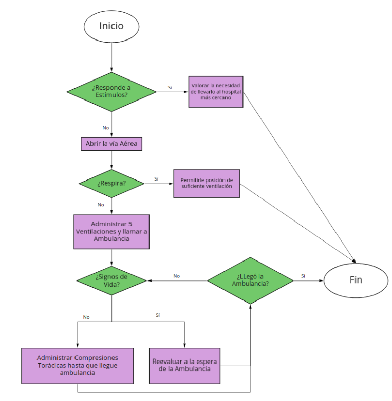

# Actividad 1 - Filtrado compacto
Una empresa provee de los balances del año anterior en un diccionario como se muestra a
continuación:

```python
ventas = {
"Enero": 15000,
"Febrero": 22000,
"Marzo": 12000,
"Abril": 17000,
"Mayo": 81000,
"Junio": 13000,
"Julio": 21000,
"Agosto": 41200,
"Septiembre": 25000,
"Octubre": 21500,
"Noviembre": 91000,
"Diciembre": 21000,
}
```

El programa mayor_a.py debe retornar un diccionario con el mes y el valor asociado
siempre y cuando superen el umbral especificado.

# Actividad 2 - Primeros auxilios

En cualquier momento puede haber una emergencia y hay que estar preparados ¿sabrías
cómo reaccionar en caso de que alguien necesite de primeros auxilios?
Es muy probable que mucha gente no conozca cuáles son los pasos a seguir en caso de
emergencia. Es por eso que se le solicita construir una aplicación que permita indicar los
pasos a seguir ante una emergencia. Debido a que no se espera que usted sea un experto en
el tema se le provee de un diagrama que explica las distintas instancias a la que se está
sometido durante una emergencia.




# Actividad 3 - Fuerza bruta

¿Qué tan seguro es tu password? ¿Intentemos hackear un password? Mediante el siguiente
desafío se busca utilizar un algoritmo muy sencillo, llamado fuerza bruta para determinar
cuántos intentos son necesarios para encontrar combinaciones numéricas en minúscula.
Para ello se ingresará un password oculto. Este password puede contener sólo
combinaciones de letras y se requiere determinar su seguridad. Un mayor número de intentos
implica un password más seguro:

El programa fuerza_bruta.py debe intentar todas las combinaciones de letras posibles, en
orden alfabético, hasta que la combinación de letras sea igual a la de la contraseña indicada.
Deberá hacer este proceso letra por letra, de izquierda a derecha.

## Consideraciones

- Utilizar from string import ascii_lowercase
○ ascii_lowercase es un string con todas las letras del abecedario en
minúsculas (sin la ñ).
- No considerar la ñ.
- Considera mayúsculas y minúsculas como una misma letra.
- Se considera "intento" cada vez que se compara una letra.

### Ejemplo:

- Usuario ingresa "abc"
- El computador compara:
+ a es igual a a => Sí (1 intento), continúa con la siguiente letra.
+ b es igual a a => No (2 intentos), prueba otra comparación.
+ b es igual a b => Sí (3 intentos), continúa con la siguiente letra.
+ c es igual a a => No (4 intentos), prueba con otra comparación.
+ c es igual a b => No (5 intentos), prueba con otra comparación.
+ c es igual a c => Sí (6 intentos), continúa con la siguiente letra.
+ No hay más letras. Se adivinó la palabra en 6 intentos.
NOTA: A modo explicativo se mostrará la contraseña a buscar pero la idea es que ésta se
ingrese de manera oculta.

```python
python fuerza_bruta.py
Ingrese la contraseña: gato
La contraseña fue forzada en 43 intentos
```